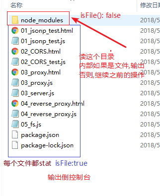
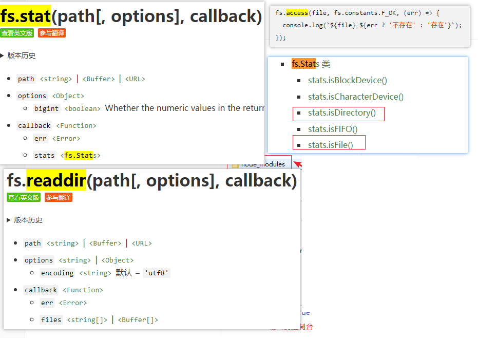
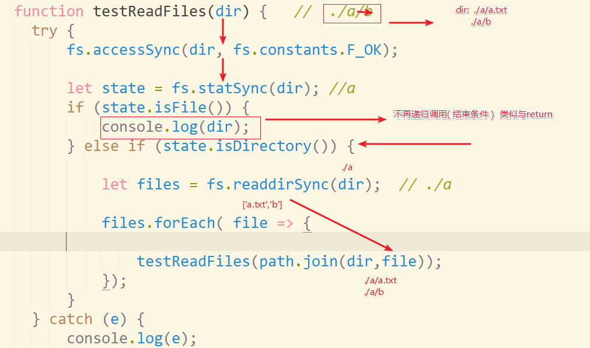
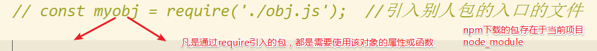

## Node基础

#### 复习(遍历文件夹下的文件)

* 读取文件夹,获取其中所有文件的资源


* stat 获取文件状态
* readdir 读取文件夹数据
* access 判断文件或文件夹是否存在








#### 包（文件夹）

* 多个文件，有效的被组织与管理的一个单位
* 留一个入口
* __包就是一个:文件夹__

#### npm|| yarn
* 自己先有一个包描述文件（__package.json__)
* 创建一个包描述文件 `npm init [-y]`
    * 会根据当前的文件夹来自动生成包名（__不允许中文，不允许大写英文字母__)
    * 默认生成```npm init [-y]```
* 下载一个包 `npm install art-template jquery@1.5.1 --save`
    - 记录依赖`--save`
* 根据package.json文件中的`dependencies`属性恢复依赖
    - 恢复包 `npm install`   简单: ```npm i ```
* 卸载一个包 `npm uninstall jquery@1.5.1 --save`
* 简写```npm un jquery@1.5.1 --S`
    * 下载简单些:```npm i 包名```
* __小结:以上简写:  uninstall -> un ,install -> i , --save -> -S__
* 查看包的信息
    - `npm info jquery`
* 查看包的信息中的某个字段(版本)(掌握)
    - `npm info jquery versions`
* 查看包的文档
    - `npm docs jquery`
* 安装全局命令行工具
    - `npm install -g http-server`
* 卸载全局命令行工具
    - `npm uninstall -g http-server`
* 查看全局包的下载路径
    - `npm root -g`
* 修改存储目录
    * ```npm config set prefix "D:\xxx"```
    * 不要node_modules
    * 接着，修改环境变量中的path属性
      * 添加或改为```D:\xxx```
      * 目的就是为了在任意目录启动 xxx.cmd
    * 重启命令行


#### 包的区别

* 凡是我们下载到项目的node_modules中的包，基本都是拿来做require('xxx') 调用其函数和属性
* 
* 还有一类属于工具性的包（全局命令行工具)
  * 在命令行直接使用的
* 全局工具 和项目包的区别
  * __全局工具哪个目录都可以通过命令行启动，通过任意目录启动该工具，给相对路径传递任意目录的文件给该工具__
  * __项目中的包，部分具备命令行工具的能力，需要命令行环境变量的支持__

#### nrm是npm的镜像源管理工具
* 1:全局安装 `npm install -g nrm`
* 2:查看当前可选的镜像源 `nrm ls`
* 3:切换镜像源 `nrm use taobao`
* 选修: 添加自己公司私有源 ```nrm add name http://www.xxx.xxx/```

#### 包的加载机制
* 我们未来可能需要辨识一个包中，入口是否是我们想要的启动程序
* 逐级向上查找node_module,直到盘符根目录
* 1:查找node_modules下的包名文件夹中的main属性(常用)
* 2:不常用:查找node_modules下的包名.js
* 3:查找node_modules下的包名文件夹中的index.js(常用)
* __逐级向上,node_modules,要么main属性,要么index.js__

### http核心模块
---
#### http超文本传输协议
* 协议至少双方 -> http双方！！
    * 客户端(浏览器)    -> 服务器  BS
    - 原生应用(QQ)  -> 服务器 CS

* 就是数据如何传输

* 特点:

    * 一问一答（先有请求，后有响应）
    * 5大特点：
        * 轻便/    简单快速       支持客户/服务器模式 
        * 无连接（不为每一个请求保持住链接）
        * 无状态( 服务器不记得客户端是谁 ) -> cookie

#### 请求与响应交互的过程
* 见图

#### 主体对象（核心对象http)
* 服务器对象 ```http.createServer();```
* 客户端对象```http.request({host:'www.baidu.com'});```
* 请求报文对象(对于服务器来说，是可读)  req
* 响应报文对象(对于服务器来说，是可写) res


#### 状态码分类

* 1 开头，正在进行中
* 2开头，完成
* 3开头 ，重定向
* 4开头 ， 客户端异常
* 5开头， 服务器异常

#### 创建服务器步骤
* 1:引入http核心对象
* 2:利用http核心对象的.createServer(callback); 创建服务器对象
* 3:使用服务器对象.listen(端口,ip地址) 开启服务器
* 4:callback(req,res) 根据请求处理响应

#### 请求报文对象(只读)
* 请求首行中的url `req.url ` 
* 请求首行中的请求方式 `req.method`
* 请求头中的数据`req.headers`  是一个对象
* 头信息中，也可以作为与服务器交互的一种途径

#### 响应对象

* 响应首行 `res.writeHead(状态码)`
* 写响应头 
  * 一次性写回头信息
    * `res.writeHead(200,headers)`
  * 多次设置头信息
    * `res.setHeader(key,value);`
* 写响应体
  * 一次性写回响应体
    * `res.end();`
  * 多次写回响应体
    * `res.write();`

#### 请求与响应

* 头行体
* content-type是对请求或者响应体数据，做出的说明

#### 响应体数据

* res.write('字符串'||读出文件的二进制数据)

* res.end('字符串'||读出文件的二进制数)

  ​

#### 获取请求体数据

* 代码对比


* 浏览器:  $('#xx').on('submit',function(e){    })
* 服务器:  req.on('data',function(d){ d.toString(); })


#### 总结梳理

* http故事剧情中的主角 :  服务器（女）（响应报文） 客户端（男）（请求报文）
  * 因为都是男人主动找女人
  * 服务器:http.createServer创建服务器，监听端口listen，处理响应on('request',(req,res)=> { })
  * 请求报文： 由于我们是服务端代码，所以该报文是浏览器发的，我们看就行了
    * 头行体（异步）
  * 响应保温：由于我们是服务端代码，所以响应报文，我们写就行了
    * 头行体
      * 头设置1次，和多次
      * 体写1次和多次 


#### querystring核心对象

* querystring.parse(formStr)
* username=jack&password=123转换成如下
* { username: 'jack', password: '123' }

#### 回写页面
* 做一个简单的查询功能,查询后,页面跳转,显示查询结果
* 数据关系是英雄名称
* 请求方式必须是get请求

#### 跨域问题

* 传统开发方式:前端代码及请求数据接口都在同一个服务器上,前端代码测试依赖服务器
* 前后端分离:
  * 静态服务器: 运行前端代码
  * 后台服务器: 运行数据接口服务器
  * __互不影响,浏览器向其他服务器发送ajax请求,会产生跨域__


#### jsonp

* 知识点补充

* url核心对象

  * ```js
    const url = require('url');
    url.parse('http://xxx.com?id=1',true); // 第二个参数是将id=1转换成对象
    // output:  { protocal:'http',..省略..query:{id:1}   }
    ```

  * ​

#### CORS

* ```
  Access-Control-Allow-Origin: 'http://xxx.com'  //允许哪个域在跨域的时候访问,*代表所有
  // 告诉浏览器,跨域时允许有cookie,同时客户端也要设置withCredentials:true + Origin不能是*
  Access-Control-Allow-Credentials: true  
  Access-Control-Allow-Methods: 'GET,POST,PUT,DELETE';   // 默认允许get/post
  Access-Control-Allow-Headers:'xxx';   // 允许你自己加的头来通信
  ```

* 浏览器在非简单请求(get/post)||包含自定义头||content-type非键值对的时候,会先请示服务器,来一个OPTIONS请求,如果不满足,拒绝发送ajax请求

#### 代理

* 下载依赖包便于请求操作 ```npm i request -S```

#### nginx代理

* __操作最好在管理员权限下进行__
* nginx -s [opt]  opt:stop, quit, reopen, reload


* 启动nginx: 命令行进入到解压目录 ```start nginx ```
* 查看nginx启动进程 ```tasklist /fi "imagename eq nginx.exe"```
* 关闭进程 ```nginx -s stop```

