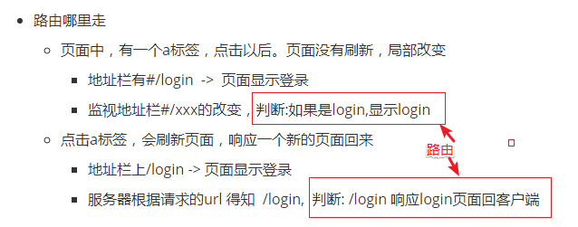

### 准备开始

------

#### 启程helloworld

- 安装`npm i express -S`
- 1:引入express第三方对象
- 2:构建一个服务器对象
- 3:开启服务器监听端口
- 4:处理响应
- 在express中，保留了原生http的相关属性和函数

#### app.use(虚拟目录,fn)

- 小练习
  - 选择性荤菜素菜
- 用户/abc/def的请求
  - 选择性调用app.use('/abc',fn)的中间件
  - 但是内部req.url则去除了/abc这个暗号
- app.use(fn)是任何请求都会触发执行的

#### 中间件类别(了解)

- 应用级中间件 `app.use(事fn)`
- 路由级中间件 
  - 1:获取路径级中间件
  - 2:配置路由
  - 3:加入到应用程序控制中`app.use(router);`
- 内置中间件
  - 处理一些静态资源文件的返回(设置将某个目录下的资源文件向外暴露)  
    - 当url匹配上我设置的目录下的子文件后，自动返回该文件
    - 加入到应用程序控制中`app.use(内置中间件);`
- 第三方中间件
  - 更方便的处理cookie/session,简易的解析post请求体数据
  - 在npm上下载并使用
  - 加入到应用程序控制中`app.use(第三方中间件);`
- 错误处理中间件
  - 在express中统一处理错误```next(err)```

#### 路由中间件

- 一个请求进来(总网线),分发到各自不同的处理(分多根网线给其他人)
  - __分流__
- 后端路由
  - (请求方式 + URL = 判断依据)(分流的判断依据) -> 做不同的处理(分流后的行为)
- 使用步骤
  - 1:获取路由中间件对象 `let router = express.Router();`
  - 2:配置路由规则 `router.请求方式(URL,fn事)`
    - fn中参数有req,res,next
  - 3:将router加入到应用`app.use(router)`


#### 路由

* 

#### res扩展函数

```javascript
res.download('./xxx.txt') // 下载文件
res.json({})  // 响应json对象
res.jsonp(数据) // 配合jsonp   要求客户端请求的时候也是jsonp的方式,  并且callback=xxx
res.redirect()  //  重定向 301是永久重定向, 302临时重定向
res.send()    // 发送字符串数据自动加content-type
res.sendFile() // 显示一个文件
res.sendStatus() // 响应状态码
```

- 总结
  - res.json() 响应数据,最常用 , 返回ajax数据
  - redirect() 重定向
  - download() 下载
  - 
  - jsonp() 跨域处理

### 模板渲染

------

#### 使用art-template模板引擎

- 下载express-art-template art-template
- app.js中配置
  - 注册一个模板引擎
    - `app.engine('.html',express-art-template);`
      - 设置默认渲染引擎```app.set('view engine','.html');```
  - res.render(文件名,数据对象);
  - express这套使用，默认在当前app.js同级的views目录查找

#### 内置中间件(处理静态资源)

- 1: 创建对象 ```let static = express.static('./public');```
- 2: 配置到中间件中 ```app.use(static);```

#### 第三方中间件(post请求体的获取)

- 原生的:`req.on('data',data=>{ data.toString();})`

```javascript
const bodyParser = require('body-parser');
// 解析键值对application/x-www-form-urlencoded
app.use(bodyParser.urlencoded({ extended: false })); 
// 不用扩展的库来解析键值对，而使用node内置核心对象querystring来解析键值对
// 解析application/json
app.use(bodyParser.json());

```

#### 服务端处理错误和404页面找不到

- 404页面响应```router.all('*',()=>{} )```
- 触发错误
  - next(err);
  - 处理错误  app.use( 4参数函数 )

#### nodemon

- 修改代码自动重启
- 安装全局命令行工具 `npm i -g nodemon`
- 进入到指定目录命令行 `nodemon ./xxx.js`
- 手动触发重启，在命令行输入 rs回车


#### 案例

* 展示一个用户列表页面（页面中也请求js）


------


#### MongoDB

- 一个数据库对应多个集合
  - 一个集合对应多个文档对象
  - 在mongo中不论是db还是集合，你都无需去创建他
  - 直接就当他已经存在，直接Use来使用
    - use db名称;
      - 接着会被切换到该db中
      - `db.要创建的集合名称.save({})`;这样集合就被创建了
- 1:启动服务器
  - `mongod --dbpath "D:/mongodb/db"` // 目录一定要存在自己创建随便名称‘
    - 尽量设置在非系统盘 `C盘生成目录是需要权限的`
  - 如果看到`waiting for connections on port 27017`说明服务已经启动
- 客户端连接服务器**另开一个命令行**
  - `mongo` 默认连接的是test数据库
- 查询有哪些数据库  
  - 查询数据库：`show dbs;`
  - 切换数据库: `use 数据库名;`
- 查询当前db下有哪些集合
  - `show collections;`
- 查询数据：
  - `db.集合名.find();`  //查询出来的是文档对象 document
  - `db.users.find();`
- 添加数据:
  - `db.集合名.save(对象)` //mongo默认会给我们加入_id作为该文档对象的唯一标识
  - `db.users.save({contry:'中国',name:'小明',score:77});`
- 删除数据:
  - `db.集合名.remove(条件对象);`//条件匹配就会被删除
  - `db.users.remove({name:'小明'});`
  - 如果给定一个空对像，会匹配全部
- 更新数据:
  - `db.集合名.update({匹配条件对象},{$set:{修改后的对象}});`
  - `db.users.update({name:'小明'},{$set:{contry:'印度'}});;`

#### 条件查询

```
练习：
  查询姓名为小明的学生
        db.users.find({name:'小明'});;   查询英语成绩大于90分的同学
        db.users.find({score:{$gt:90}}); //查找成绩大于90分$gt
        //$lt小于
 查询数学成绩不等于88的同学
        db.users.find({score:{$ne:88}});   查询总分大于200分的所有同学
        db.users.find({score:{$gt:200}});
```

#### 分页

- `db.users.find().skip(3).limit(3);`
- db.集合名称.find().跳到3.显示3条
      + limit 0,3

#### 排序

- `db.users.find().sort({key:排序方式});`
- `db.users.find().sort({'score':1});` //正数代表升序，负数代表降序

#### 模糊匹配

- `db.users.find({name:{$regex:'小'}});`
- `db.users.find({name:{$regex:'明'}});`

#### 聚合函数

- 需要求当前集合的记录数：
- `db.users.find().count();`
- 求最大值
  -求整个集合的总成绩
      + db.集合名.聚合({ 组的划分规则{_id:'1',显示内容:{$sum:'$score'}} })
  - 求所有人的平均分
    - `db.users.aggregate({$group:{_id:'1',sumscore:{$avg:'$score' } }});`
  - 求按国家分组，求所有国家的总分
    - `db.users.aggregate({$group:{_id:'$contry',sumScore:{$sum:'$score'}}});`
- 添加基础数据:
  db.users.save({contry:'中国',name:'小明',score:77});
  db.users.save({contry:'中国',name:'小红',score:88});
  db.users.save({contry:'中国',name:'小张',score:99});
  db.users.save({contry:'美国',name:'jack',score:45});
  db.users.save({contry:'美国',name:'rose',score:67});
  db.users.save({contry:'美国',name:'mick',score:89});

解决32位异常
mongod --dbpath="路径" --journal --storageEngine=mmapv1


#### 配置https

- 公钥  公开的加密方式
- 私钥  存在服务器的唯一解公钥加密的方式
- 签名  确保数据的一致性
- 证书  确保当前发送数据单位可信